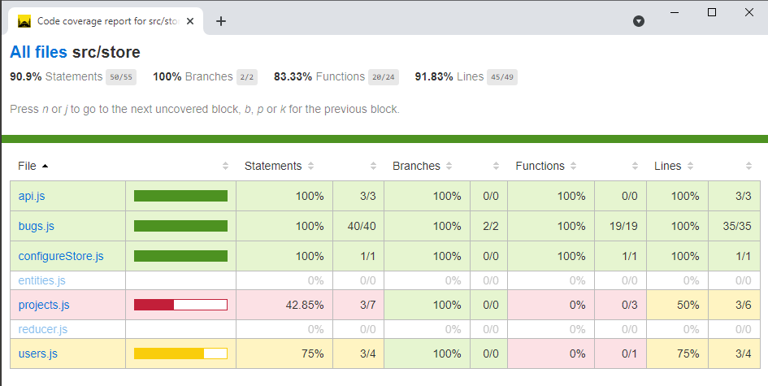
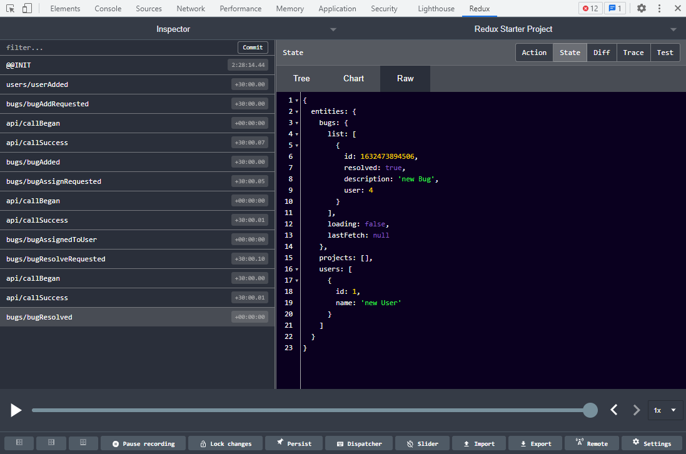

# Redux Experiments

- Redux Toolkit https://redux-toolkit.js.org/

# Redux Testing

- Jest https://jestjs.io/
- Axios Mock Adaptor https://github.com/ctimmerm/axios-mock-adapter

# Redux Test Coverage

14 tests are passing now.
Covered over 90% statements.

# Momoized selectors with Reselect

https://github.com/reduxjs/reselect

# Redux Dev Tools

